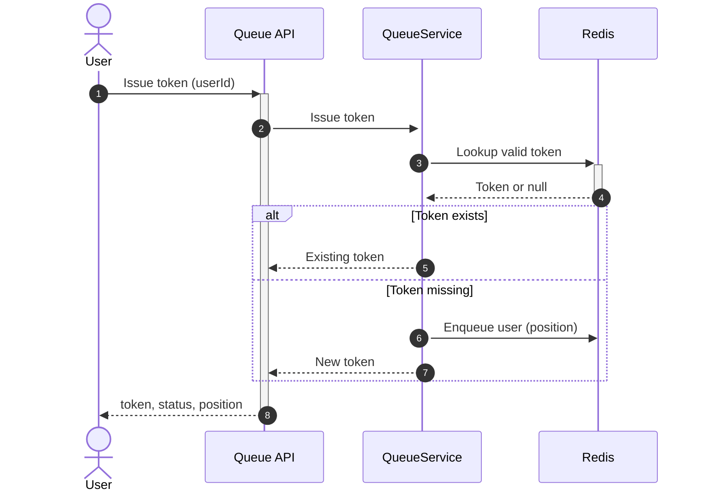
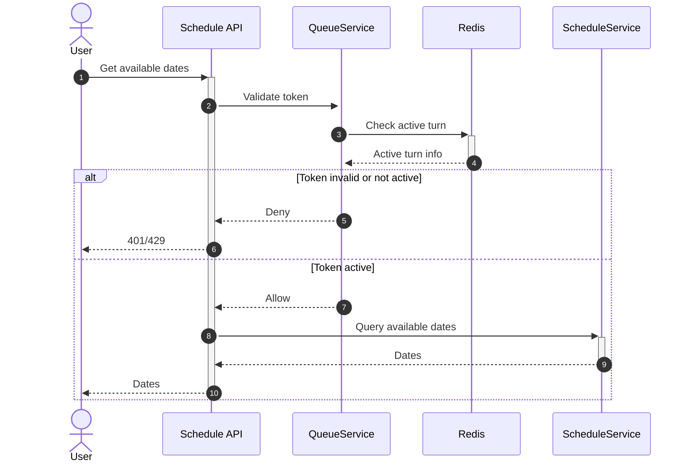
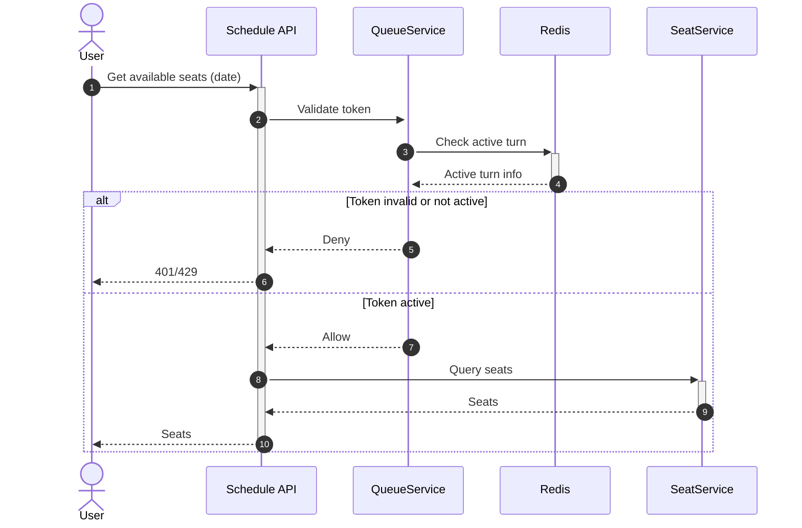
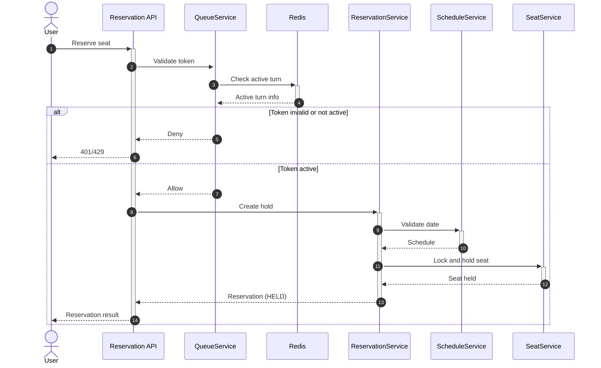
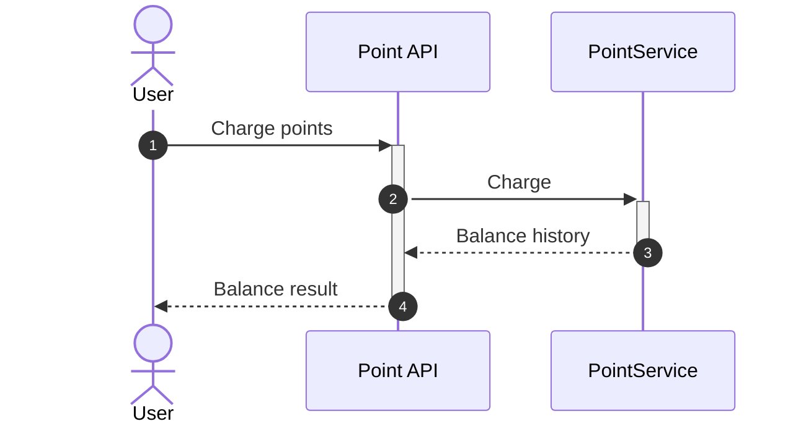
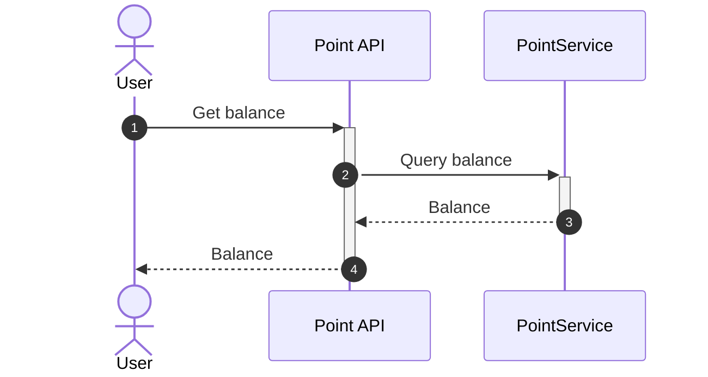
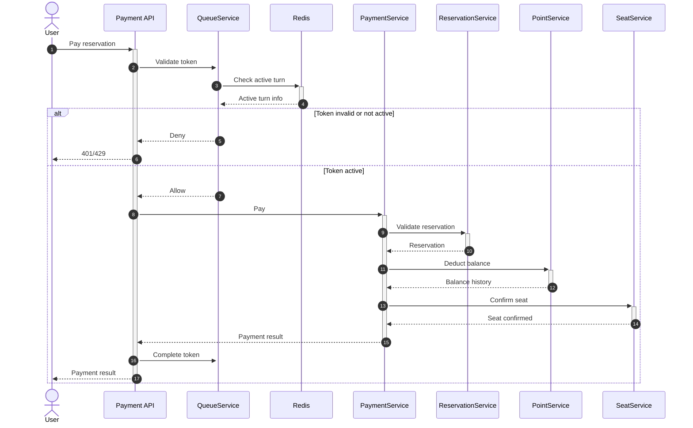

# 시퀀스 다이어그램

## 유저 대기열 토큰 발급

- 유저는 서비스 이용 전에 대기열 토큰을 발급받습니다.
- 유효한 토큰이 존재하면 동일 토큰을 반환합니다.

```mermaid
sequenceDiagram
    autonumber
    actor User as User
    participant QueueAPI as Queue API
    participant QueueService as QueueService
    participant Redis as Redis

    User ->>+ QueueAPI: Issue token (userId)
    QueueAPI ->>+ QueueService: Issue token
    QueueService ->>+ Redis: Lookup valid token
    Redis -->>- QueueService: Token or null

    alt Token exists
        QueueService -->> QueueAPI: Existing token
    else Token missing
        QueueService ->> Redis: Enqueue user (position)
        QueueService -->> QueueAPI: New token
    end

    QueueAPI -->>- User: token, status, position
```

## 예약 가능 날짜 조회

```mermaid
sequenceDiagram
    autonumber
    actor User as User
    participant ScheduleAPI as Schedule API
    participant QueueService as QueueService
    participant Redis as Redis
    participant ScheduleService as ScheduleService

    User ->>+ ScheduleAPI: Get available dates
    ScheduleAPI ->>+ QueueService: Validate token
    QueueService ->>+ Redis: Check active turn
    Redis -->>- QueueService: Active turn info

    alt Token invalid or not active
        QueueService -->> ScheduleAPI: Deny
        ScheduleAPI -->> User: 401/429
    else Token active
        QueueService -->> ScheduleAPI: Allow
        ScheduleAPI ->>+ ScheduleService: Query available dates
        ScheduleService -->>- ScheduleAPI: Dates
        ScheduleAPI -->>- User: Dates
    end
```

## 예약 가능 좌석 조회

```mermaid
sequenceDiagram
    autonumber
    actor User as User
    participant ScheduleAPI as Schedule API
    participant QueueService as QueueService
    participant Redis as Redis
    participant SeatService as SeatService

    User ->>+ ScheduleAPI: Get available seats (date)
    ScheduleAPI ->>+ QueueService: Validate token
    QueueService ->>+ Redis: Check active turn
    Redis -->>- QueueService: Active turn info

    alt Token invalid or not active
        QueueService -->> ScheduleAPI: Deny
        ScheduleAPI -->> User: 401/429
    else Token active
        QueueService -->> ScheduleAPI: Allow
        ScheduleAPI ->>+ SeatService: Query seats
        SeatService -->>- ScheduleAPI: Seats
        ScheduleAPI -->>- User: Seats
    end
```

## 좌석 예약 요청

```mermaid
sequenceDiagram
    autonumber
    actor User as User
    participant ReservationAPI as Reservation API
    participant QueueService as QueueService
    participant Redis as Redis
    participant ReservationService as ReservationService
    participant ScheduleService as ScheduleService
    participant SeatService as SeatService

    User ->>+ ReservationAPI: Reserve seat
    ReservationAPI ->>+ QueueService: Validate token
    QueueService ->>+ Redis: Check active turn
    Redis -->>- QueueService: Active turn info

    alt Token invalid or not active
        QueueService -->> ReservationAPI: Deny
        ReservationAPI -->> User: 401/429
    else Token active
        QueueService -->> ReservationAPI: Allow
        ReservationAPI ->>+ ReservationService: Create hold
        ReservationService ->>+ ScheduleService: Validate date
        ScheduleService -->>- ReservationService: Schedule
        ReservationService ->>+ SeatService: Lock and hold seat
        SeatService -->>- ReservationService: Seat held
        ReservationService -->>- ReservationAPI: Reservation (HELD)
        ReservationAPI -->>- User: Reservation result
    end
```

## 포인트 충전

```mermaid
sequenceDiagram
    autonumber
    actor User as User
    participant PointAPI as Point API
    participant PointService as PointService

    User ->>+ PointAPI: Charge points
    PointAPI ->>+ PointService: Charge
    PointService -->>- PointAPI: Balance history
    PointAPI -->>- User: Balance result
```

## 포인트 조회

```mermaid
sequenceDiagram
    autonumber
    actor User as User
    participant PointAPI as Point API
    participant PointService as PointService

    User ->>+ PointAPI: Get balance
    PointAPI ->>+ PointService: Query balance
    PointService -->>- PointAPI: Balance
    PointAPI -->>- User: Balance
```

## 결제

```mermaid
sequenceDiagram
    autonumber
    actor User as User
    participant PaymentAPI as Payment API
    participant QueueService as QueueService
    participant Redis as Redis
    participant PaymentService as PaymentService
    participant ReservationService as ReservationService
    participant PointService as PointService
    participant SeatService as SeatService

    User ->>+ PaymentAPI: Pay reservation
    PaymentAPI ->>+ QueueService: Validate token
    QueueService ->>+ Redis: Check active turn
    Redis -->>- QueueService: Active turn info

    alt Token invalid or not active
        QueueService -->> PaymentAPI: Deny
        PaymentAPI -->> User: 401/429
    else Token active
        QueueService -->> PaymentAPI: Allow
        PaymentAPI ->>+ PaymentService: Pay
        PaymentService ->>+ ReservationService: Validate reservation
        ReservationService -->>- PaymentService: Reservation
        PaymentService ->>+ PointService: Deduct balance
        PointService -->>- PaymentService: Balance history
        PaymentService ->>+ SeatService: Confirm seat
        SeatService -->>- PaymentService: Seat confirmed
        PaymentService -->>- PaymentAPI: Payment result
        PaymentAPI ->> QueueService: Complete token
        PaymentAPI -->>- User: Payment result
    end
```
