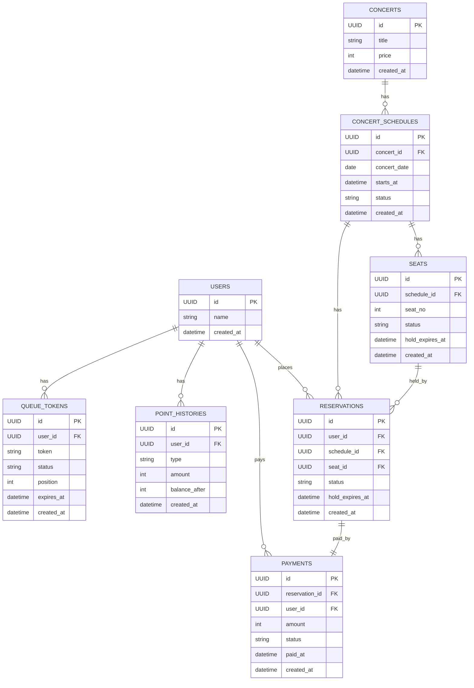

# ERD

## 테이블 설명

- **USERS**: 서비스 사용자 정보
- **QUEUE_TOKENS**: 대기열 토큰 및 상태(WAITING, ACTIVE, DONE, EXPIRED)
- **POINT_HISTORIES**: 포인트 충전/사용 내역과 잔액 스냅샷
- **CONCERTS**: 콘서트 기본 정보(가격 포함)
- **CONCERT_SCHEDULES**: 공연 날짜별 일정
- **SEATS**: 일정별 좌석 상태(AVAILABLE, HELD, RESERVED)
- **RESERVATIONS**: 좌석 예약 내역(HELD, CONFIRMED, EXPIRED, CANCELLED)
- **PAYMENTS**: 결제 내역

## 제약 및 인덱스

- `SEATS(schedule_id, seat_no)`에 **유니크 제약**으로 좌석 중복 생성 방지
- `RESERVATIONS(seat_id, status)`에 **부분 유니크 제약**(HELD/CONFIRMED)로 동시 예약 방지
- `QUEUE_TOKENS(token)` 인덱스로 토큰 검증 성능 확보
- `POINT_HISTORIES(user_id, created_at)` 인덱스로 잔액 조회 성능 확보
