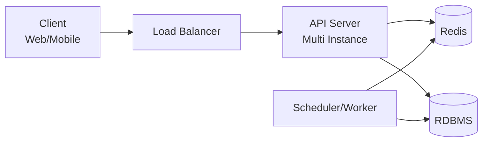

# 인프라 구성도

## 구성 요소 설명

- **Client**: 웹/모바일 클라이언트로 API를 호출합니다.
- **Load Balancer**: 다중 인스턴스로 트래픽을 분산합니다.
- **API Server**: 예약/결제/포인트/대기열 API를 처리합니다.
- **Redis**: 대기열 토큰 상태, 순번, 임시 좌석 점유 상태를 빠르게 조회/검증합니다.
- **RDBMS**: 사용자, 예약, 좌석, 결제, 포인트 내역 등 영속 데이터를 저장합니다.
- **Scheduler/Worker**: 임시 배정 좌석 만료 처리와 만료된 대기열 토큰 정리를 수행합니다.

## 운영 포인트

- API 서버는 수평 확장이 가능하도록 stateless하게 운영합니다.
- 좌석 홀드 만료는 스케줄러 또는 만료 이벤트 기반으로 처리합니다.
