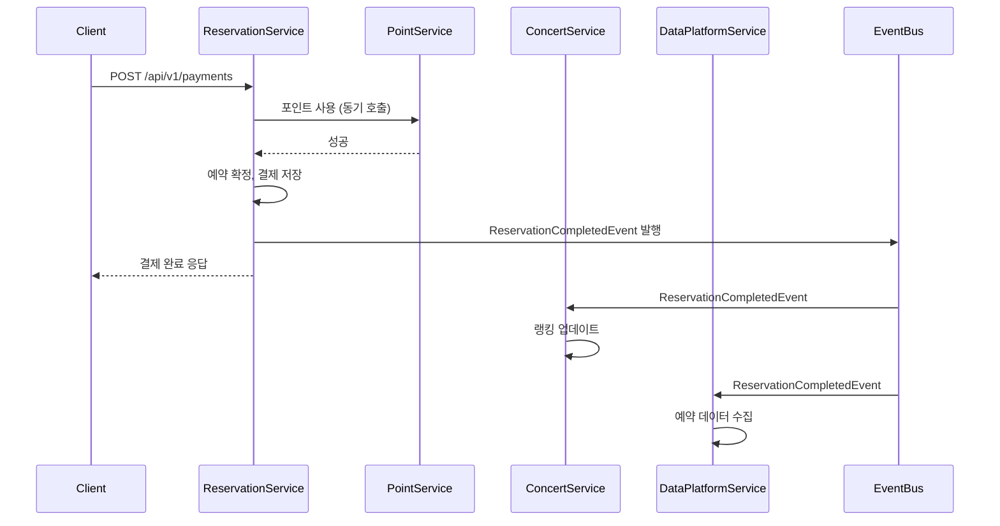
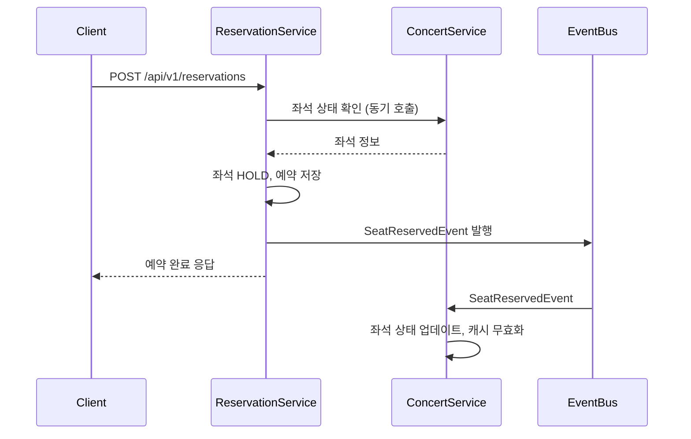
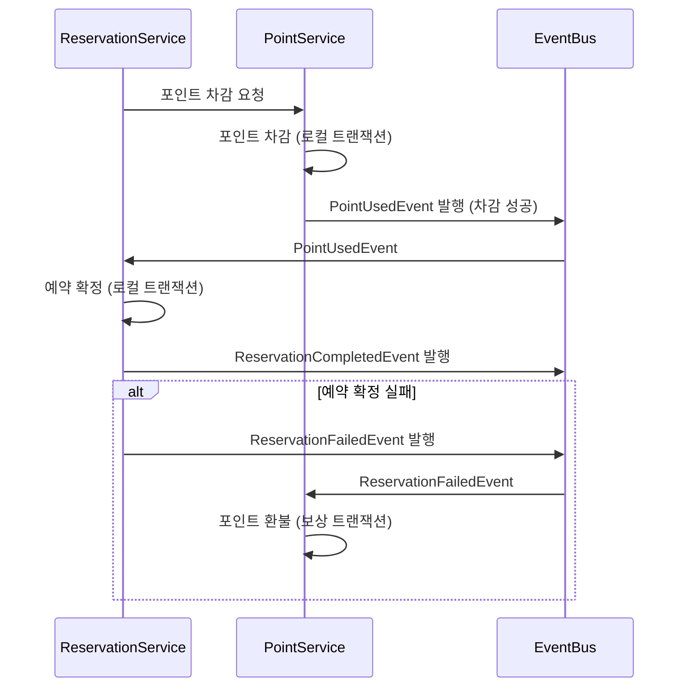

# MSA 분리 설계 문서

## 1. 개요

콘서트 예매 시스템을 MSA(Microservices Architecture) 형태로 분리할 경우의 설계안과 트랜잭션 처리 방안에 대한 문서화.

## 2. 도메인 분리 설계

### 2.1 서비스 도메인 분류

현재 모놀리식 구조를 다음과 같은 서비스로 분리

#### 2.1.1 Reservation Service (예약 서비스)
- **책임**: 좌석 예약, 결제 처리, 예약 상태 관리
- **데이터**: Reservation, Payment, Seat (예약 관련)
- **API**:
  - `POST /api/v1/reservations` - 좌석 예약
  - `POST /api/v1/payments` - 결제 처리
- **이벤트 발행**:
  - `ReservationCompletedEvent` - 예약 완료 시 발행
  - `ReservationExpiredEvent` - 예약 만료 시 발행

#### 2.1.2 Point Service (포인트 서비스)
- **책임**: 포인트 충전, 포인트 사용, 잔액 조회
- **데이터**: UserPoint
- **API**:
  - `POST /api/v1/points/charge` - 포인트 충전
  - `GET /api/v1/points/{userId}` - 잔액 조회
- **이벤트 발행**:
  - `PointChargedEvent` - 포인트 충전 완료 시 발행
  - `PointUsedEvent` - 포인트 사용 완료 시 발행

#### 2.1.3 Queue Service (대기열 서비스)
- **책임**: 대기열 토큰 발급, 상태 관리, 순번 관리
- **데이터**: ReservationToken
- **API**:
  - `POST /api/v1/queue/tokens` - 토큰 발급
- **이벤트 발행**:
  - `QueueTokenActivatedEvent` - 토큰 활성화 시 발행
  - `QueueTokenExpiredEvent` - 토큰 만료 시 발행

#### 2.1.4 Concert Service (콘서트 서비스)
- **책임**: 콘서트 정보 조회, 좌석 조회, 랭킹 관리
- **데이터**: ConcertDate, Seat (조회용)
- **API**:
  - `GET /api/v1/concerts/dates` - 예약 가능 날짜 조회
  - `GET /api/v1/concerts/dates/{date}/seats` - 좌석 조회
  - `GET /api/v1/concerts/ranking` - 빠른 매진 랭킹 조회
- **이벤트 구독**:
  - `ReservationCompletedEvent` - 랭킹 업데이트를 위해 구독
  - `SeatReservedEvent` - 좌석 상태 업데이트를 위해 구독

#### 2.1.5 Data Platform Service (데이터 플랫폼 서비스)
- **책임**: 예약 데이터 수집 및 분석
- **이벤트 구독**:
  - `ReservationCompletedEvent` - 예약 완료 데이터 수집

## 3. 이벤트 기반 흐름 제어

### 3.1 예약 완료 플로우

### 3.2 좌석 예약 플로우

## 4. 분산 트랜잭션 문제 및 해결방안

### 4.1 문제 상황

#### 4.1.1 예약 완료 시 포인트 차감과 예약 확정의 분산 트랜잭션
- **문제**: Reservation Service에서 포인트 차감(Point Service)과 예약 확정(Reservation Service)을 하나의 트랜잭션으로 처리할 수 없음
- **영향**: 포인트 차감은 성공했으나 예약 확정이 실패할 경우 포인트가 차감된 채로 남음

#### 4.1.2 예약 완료 후 후속 작업의 일관성
- **문제**: 예약 완료 후 랭킹 업데이트, 데이터 플랫폼 전송 등이 실패할 수 있음
- **영향**: 데이터 불일치 발생 가능

#### 4.1.3 예약 만료 처리
- **문제**: Reservation Service와 Concert Service 간 좌석 상태 동기화 필요
- **영향**: 예약 만료 후 좌석이 해제되지 않을 수 있음

### 4.2 해결 방안

#### 4.2.1 Saga 패턴 (코레오그래피 방식)

**예약 완료 플로우 (Saga 패턴 적용)**

**장점**:
- 각 서비스가 독립적으로 동작하여 결합도가 낮음
- 서비스별 책임이 명확함
- 확장성과 유연성이 높음

**단점**:
- 전체 흐름 파악이 어려움
- 디버깅과 테스트가 복잡함
- 보상 트랜잭션 구현 필요

#### 4.2.2 이벤트 기반 보상 트랜잭션

**이벤트 정의**:
- `ReservationCompletedEvent`: 예약 완료
- `ReservationFailedEvent`: 예약 실패 (보상 트리거)
- `PointRefundedEvent`: 포인트 환불 완료

**보상 로직**:
1. Reservation Service에서 예약 확정 실패 시 `ReservationFailedEvent` 발행
2. Point Service가 `ReservationFailedEvent`를 구독하여 포인트 환불 수행
3. 환불 완료 후 `PointRefundedEvent` 발행하여 다른 서비스에 알림

#### 4.2.3 최종 일관성 보장

**이벤트 중복 처리 방지**:
- 이벤트에 고유 ID 부여
- 각 서비스에서 처리한 이벤트 ID를 저장하여 중복 처리 방지

**이벤트 재시도**:
- 이벤트 처리 실패 시 재시도 큐에 추가
- 최대 재시도 횟수 설정
- 재시도 실패 시 Dead Letter Queue로 이동하여 수동 처리

**이벤트 순서 보장**:
- 단일 파티션 사용 (순서 보장 필요 시)
- 이벤트에 타임스탬프 부여하여 순서 확인

## 5. 서비스 간 통신 방식

### 5.1 동기 통신 (API 호출)

**사용 사례**:
- Reservation Service → Point Service: 포인트 차감 (즉시 응답 필요)
- Reservation Service → Concert Service: 좌석 상태 확인 (즉시 응답 필요)

**장점**:
- 즉시 응답 확인 가능
- 에러 처리 용이

**단점**:
- 서비스 간 강한 결합
- 장애 전파 가능성
- 성능 저하 가능성

### 5.2 비동기 통신 (이벤트)

**사용 사례**:
- Reservation Service → Concert Service: 랭킹 업데이트
- Reservation Service → Data Platform Service: 데이터 수집
- Reservation Service → Point Service: 보상 트랜잭션 (포인트 환불)

**장점**:
- 느슨한 결합
- 성능 향상
- 장애 격리

**단점**:
- 최종 일관성
- 디버깅 어려움
- 중복 처리 방지 필요

### 5.3 하이브리드 방식

- **핵심 비즈니스 로직**: 동기 통신 (즉시 확인 필요)
- **부가 로직**: 비동기 이벤트 (일관성 유지하면서 성능 확보)

## 6. 데이터 일관성 보장 전략

### 6.1 Event Sourcing (선택적)

**적용 대상**: Point Service
- 모든 포인트 변경 이벤트를 저장
- 현재 상태는 이벤트를 재생하여 계산
- 장점: 트랜잭션 히스토리 추적 가능
- 단점: 구현 복잡도 증가

### 6.2 Outbox 패턴

**적용 대상**: 모든 서비스
- 로컬 트랜잭션과 이벤트 발행을 하나의 트랜잭션으로 처리
- Outbox 테이블에 이벤트 저장 후 별도 프로세스로 발행
- 장점: 이벤트 손실 방지
- 단점: 추가 구현 필요

### 6.3 이벤트 버전 관리

- 이벤트 스키마 변경 시 버전 관리
- 하위 호환성 유지 또는 이벤트 변환 레이어 구현

## 7. 모니터링 및 관찰 가능성

### 7.1 분산 추적 (Distributed Tracing)
- 각 서비스 간 요청 추적
- 이벤트 흐름 추적
- 성능 병목 지점 파악

### 7.2 로깅
- 각 서비스에서 구조화된 로그 수집
- 이벤트 발행/구독 로그
- 보상 트랜잭션 로그

### 7.3 메트릭
- 서비스별 응답 시간
- 이벤트 처리 시간
- 실패율 및 재시도율

## 8. 배포 전략

### 8.1 데이터베이스 분리
- 각 서비스는 독립적인 데이터베이스 보유
- 데이터베이스 간 직접 접근 금지

### 8.2 API Gateway
- 단일 진입점 제공
- 인증/인가 처리
- 라우팅 및 로드 밸런싱

### 8.3 이벤트 브로커
- Kafka 또는 RabbitMQ 사용
- 이벤트 저장 및 전달
- 순서 보장 및 중복 제거

## 9. 마이그레이션 전략

### 9.1 단계적 마이그레이션
1. **1단계**: Point Service 분리
   - 가장 독립적인 도메인으로 먼저 분리
   - API Gateway를 통한 라우팅 설정

2. **2단계**: Queue Service 분리
   - 대기열 로직 독립화

3. **3단계**: Concert Service 분리
   - 조회 중심 서비스로 분리

4. **4단계**: Reservation Service 분리
   - 가장 복잡한 도메인으로 마지막 분리
   - 이벤트 기반 통신 적용

### 9.2 데이터 마이그레이션
- 기존 데이터베이스에서 서비스별 데이터 분리
- 데이터 일관성 검증
- 점진적 트래픽 전환